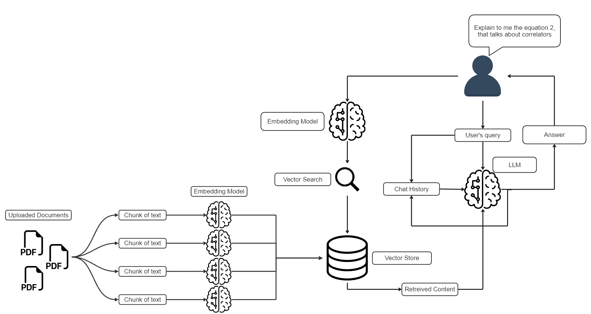

# RAG - ChatBot: Retrieval Augmented Generation (RAG) chatbot using Google's Gemini-Pro model, Langchain, ChromaDB, and Streamlit

This RAG-ChatBot is a Python application that allows the user to chat with multiple PDF documents. You ask questions in natural language, in the same way as if you were to ask a human, and the application will provide relevant responses based on the content of the uploaded documents. This app uses Google's Gemini-Pro model to generate accurate answers to your questions, but the model will only answer questions that are about the uploaded documents.
Here are some key points about the project:
- Upload Documents: When the app is launched, you can upload a PDF document and chat with the document on the fly, no need to reload the app
- Offline Documents: If you need to leave the app, when you come back, you won't need to upload the same document again, you can chat with it as soon as the app starts. Also, you can keep uploading documents to chat with all of them at the same time
- The user interface was crafted with streamlit, with the goal of displaying all necessary information while being extremely simple. The user only has the "upload" button, all the rest is automated by the app
- The model incorporates the chat history, retaining up to 10 users questions and model responses, so if you ask about something and want more details, you can just say "give me more details about that" and the model will know what you are reffering to
- For each response, you can check the source in the sidebar, making sure that the model is not making up responses

## RAG - ChatBot Interface: First Boot and In Usage
The very first time the user launches the app, this will be the screen of the app. Note that the user cannot send any messages, since there are no documents uploaded.

The next time that the user launches the app, the chat box will be available and there will be a list of the uploaded documents. If the user tries to upload the same document again, the "process" button will not appear. When the user asks a question, the model will give a response based on the question, the content that was retrieved from the database, and the chat history. In the image below, we can see that the model is aware of the chat history, and that the source of the answer is displayed in the sidebar.

## How it Works

## App Usage
